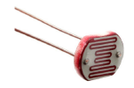
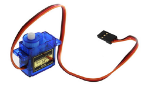
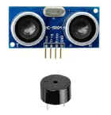
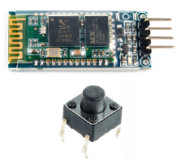
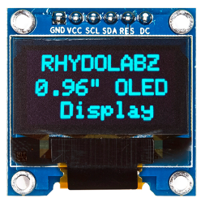
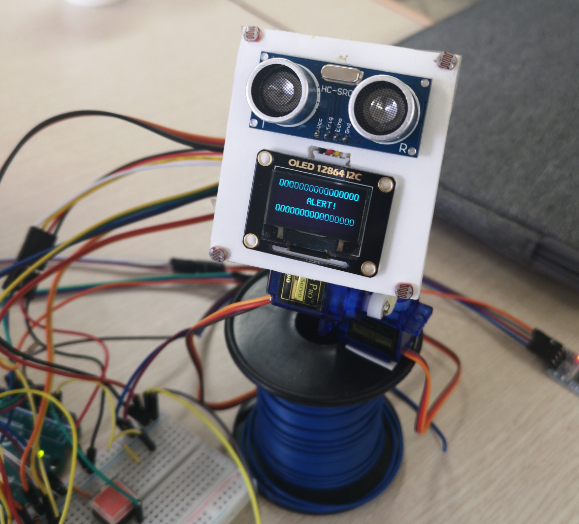
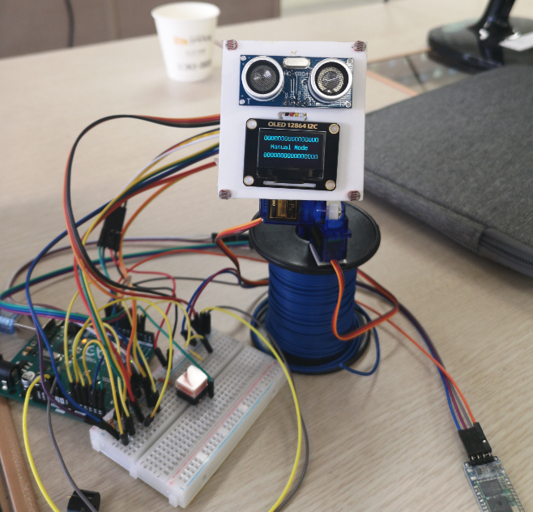
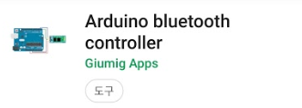
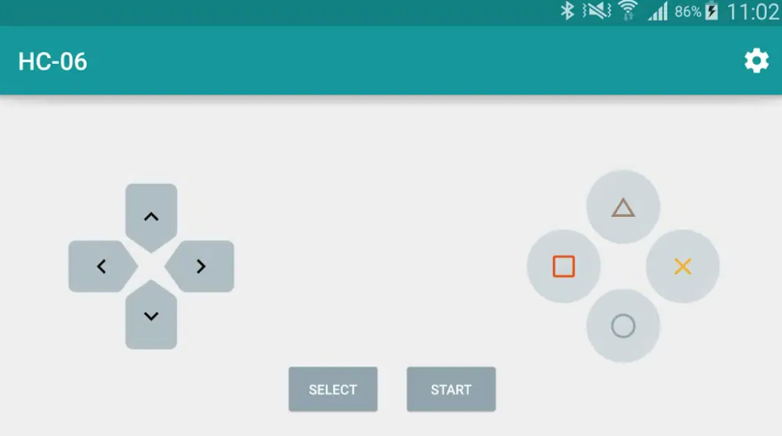
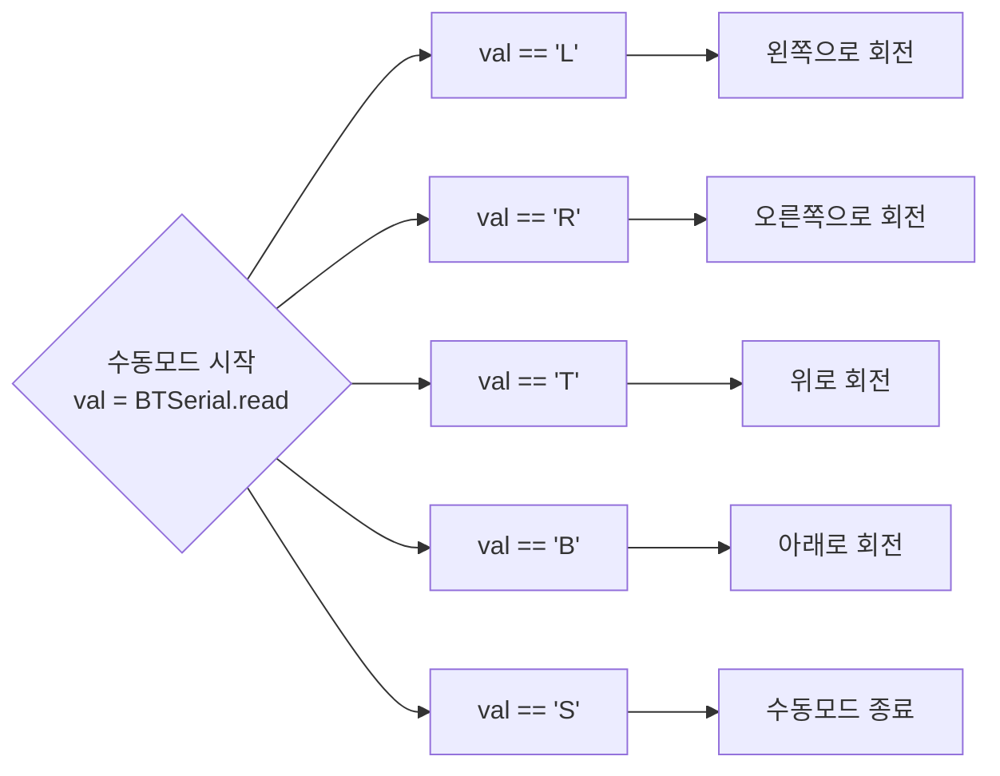

<center><h1>마이크로프로세서
    프로젝트</h1></center>
<center><h2>자동 태양 추적을 활용한 스마트 태양광 발전 시스템


## 설계 목적 

  전세계적으로 전기를 생산하기 위해 원자력 발전을 하지만 원전이 에너지원으로 이용하는 핵분열과 이로 인해 발생하는 방사능의 위험성이 크다고 한다. 원자력 발전소에서 뿜어져 나오는 방사능은 물론이고 오염된 냉각수 및 사용후 방사능 폐기물 문제가 제기되고 있으며 환경 단체들은 온실가스 배출하는 화력발전소와 함께 폐기를 주장하고 있다. 또한 원자력 발전소는 가동 중에 대기오염 물질 배출량이 타 발전원에 비해 압도적으로 적지만 우라늄 광산에서 채굴 과정 시 화석연료를 기반으로 운영되는 각종 채굴장비나 기계 등에서 배출되는 이산화탄소 양 역시 배제할 수 없다. 이런 환경문제들로 인하여 한국의 현 정부는 원전 중심의 발전정책을 폐기하는 탈(脫)원전 정책을 본격 추진했다고 한다.  이로인해 원전 가동률은 전대비 56%수준으로 떨어져 전기요금의 인상이 불가피하게 되었는데, 이러한 이유로 가정이나 여러 기업에서는 태양광 발전 패널을 이용해서 전기를 자가수급하는 일이 많아졌다고 한다.

하지만 태양광 패널을 설치해도 실제로는 일조량이 적은 곳이면 발전 효율이 떨어질 수있고,    주위의 다른 건물이나 나무 등에 의해 효율이 떨어질 수 있다. 따라서 이러한 문제들을 해결하고 기존의 태양광 패널보다 더 고효율의 태양광 발전을 할 수있고 기존에 있던 태양광 추적 센서보다 저렴한 비용으로 태양을 추적할 수있는 시스템을 고안하게 되었다.


## 설계 내용

- **조도 센서**

  > CdS Cell

  

  - 패널의 4방향에 조도 센서를 설치하고 각 조도센서의 값의 차이를 구한다.
  - 받은 조도값을 이용해 현실에서의 태양광 발전량을 대체한다.

- **서보 모터**

  > SG-90



  - 서보 모터는 수평 서보모터와 수직 서보 모터 두 개가있다.
  - 각 서보 모터는 조도 센서에서 얻은 값을 이용하여 조도 값이 높은 방향으로 패널을 회전한다.
  - 이를 통해 태양광을 가장 많이 받을 수 있는 최적의 각도가 된다.

  

- **초음파 센서, 부저**

  > HC-SR04, SM-1205C

  

  - 조류나 기타 방해물로 부터 패널에 접근이 있을 시 서보 모터를 좌우로 회전하고 부저를 울려 경고한다.

- **블루투스 센서, 스위치**

  > HC-06, ITS-1103

  

  - 스위치가 눌리면 시스템을 수동모드로 전환하고 블루투스 통신을 이용하여 스마트폰을 이용해 

    수동으로 패널의 각도를 조절할 수 있게 된다 `select` 버튼을 누르면 자동 모드로 돌아간다.  

- **OLED 모듈**

  > OLED 128x64 l2C



  - 평상시에는 태양광 발전량을 화면에 표시해준다.
  - 수동모드일 시, 화면에 `Manual Mode`라고 출력된다.
  - 경고가 작동할 때 `Alert!`라고 출력된다.


## 설계 코드

```c
#include <Servo.h>      //서보 모터 라이브러리
#include <SoftwareSerial.h>     //블루투스 라이브러리
#include "U8glib.h"     //OLED 라이브러리
SoftwareSerial BTSerial(9, 8);      //블루투스 
U8GLIB_SSD1306_128X64 u8g(U8G_I2C_OPT_NONE);      //OLED

Servo hor;      //수평 서보 모터
int moh = 90;
Servo ver;      //수직 서보 모터
int mov = 90; 

int bz = 2;     //부저
int sw1 = 3;    //스위치

int tones[] = {261, 294, 330, 349, 392, 440, 494, 523};     //부저에서 사용할 음계

int cdslt = A3;     //왼쪽 위 조도 센서
int cdsrt = A2;     //오른쪽 위 조도 센서
int cdslb = A1;     //왼쪽 아래 조도 센서
int cdsrb = A0;     //오른쪽 아래 조도 센서
float amount = 0;   //태양광 발전량 합

int echo = 6;       //초음파 센서 에코
int trig = 7;       //초음파 센서 트리거

boolean manual = false;     //수동 모드를 false로 선언

void setup() {
  Serial.begin(9600);         //시리얼 통신
  BTSerial.begin(9600);        //블루투스 통신
  hor.attach(4);               //수평 서보 모터
  ver.attach(5);               //수직 서보 모터
  //두 서보 모터 초기각도를 90도로 지정
  hor.write(moh);
  ver.write(mov);
  //초음파 센서의 echo를 입력, tigger를 출력으로 지정
  pinMode(echo, INPUT);      
  pinMode(trig, OUTPUT);
  
  pinMode(bz, OUTPUT);        //부저
  
  pinMode(sw1, INPUT_PULLUP); //스위치핀을 풀업저항으로 사용
}


void loop() {
  //조도 센서 입력받기
  int lt = analogRead(cdslt);
  int rt = analogRead(cdsrt);
  int lb = analogRead(cdslb);
  int rb = analogRead(cdsrb);
  //오차 한계 범위
  int tol = 10;
  //상, 하, 좌, 우의 조도값 평균 값을 구함
  int avgt = (lt + rt) / 2;
  int avgb = (lb + rb) / 2;
  int avgl = (lt + lb) / 2;
  int avgr = (rt + rb) / 2;
  
  amount += (lt+rt+lb+rb) / 100000.0;      //받은 조도값을 발전량에 더해줌
  oledStart();                             //oled 출력

  //상하의 차이와 좌우의 차이를 구함
  int verd = avgt - avgb;
  int hord = avgl - avgr;

  //스위치가 눌릴 경우 수동모드로 전환
  if (digitalRead(sw1) == LOW) {
    manual = !manual;
    delay(500);
  }
  
if(!manual) {     //수동모드가 아닐 경우
    //초음파 센서 사용
    digitalWrite(trig, LOW);
    digitalWrite(echo, LOW);
    delayMicroseconds(2);
    digitalWrite(trig, HIGH);
    delayMicroseconds(10);
    digitalWrite(trig, LOW);
    unsigned long duration = pulseIn(echo, HIGH); 
    float distance = ((float)(340 * duration) / 10000) / 2;  

    if (0 < distance && distance < 3)     //거리가 3cm보다 가까울 경우 경고
      alert();

if (-1 * tol > verd || verd > tol) {      //상하의 조도센서의 차이가 tol값보다 클 경우
  //아래의 조도값이 더 클 경우 패널을 아래로 회전
  if (avgt < avgb) {
    mov = ++mov;
    if(mov >= 160)
      mov = 160;
  }
  //반대의 경우
  else if (avgt > avgb) {
    mov = --mov;
    if(mov <= 20)
      mov = 20;
  }
  ver.write(mov);
}

if (-1 * tol > hord || hord > tol) {      //좌우의 조도센서의 차이가 tol값보다 클 경우
  //오른쪽의 조도값이 더 클 경우 패널을 오른쪽으로 회전
  if (avgl < avgr) {
    moh = --moh;
    if(moh <= 0)
      moh = 0;
  }
  //반대의 경우
  else if (avgl > avgr) {
    moh = ++moh;
    if(moh >= 180)
      moh = 180;
  }
  hor.write(moh);
}
}
else if (manual) {        //수동 모드일 경우
 oledPrint("  Manual Mode");      //oled에 Manual Mode라고 표시.
 boolean run = true;
while(run) {
  char val = BTSerial.read();     //블루투스로 값을 받아서 val변수에 넣는다.
  if(BTSerial.available())
    Serial.write(BTSerial.read());
  
  switch(val) {
    case 'L':       //val이 L일 경우 왼쪽으로 회전
    moh -= 5; 
    hor.write(moh);
    break;
    case 'R':       //val이 R일 경우 오른쪽으로 회전
    moh += 5;
    hor.write(moh);
    break;
    case 'T':       //val이 T일 경우 위로 회전
    mov += 5;
    ver.write(mov);
    break;
    case 'B':       //val이 B일 경우 아래로 회전
    mov -= 5;
    ver.write(mov);
    break;
    case 'S':       //val이 S일 경우 수동 모드를 중단
    manual = !manual;
    run = false;
    break;
  }
}
}
}

void oledStart() {      //oled에 발전총량을 표시해주는 함수
   u8g.firstPage();
    do{
        u8g.setFont(u8g_font_unifont);
        u8g.setPrintPos(0,10);
        u8g.print("OOOOOOOOOOOOOOOOO");
        
        u8g.setPrintPos(0,30);
        u8g.print("Amount : ");
        u8g.print(amount);
        u8g.print("W");
        
        u8g.drawStr(0,50, "OOOOOOOOOOOOOOOOO");
    }while(u8g.nextPage());

}

void oledPrint(String str) {        //oled에 원하는 문자열을 출력해주는 함수
   u8g.firstPage();
    do{
        u8g.setFont(u8g_font_unifont);

        u8g.drawStr(0,10, "OOOOOOOOOOOOOOOOO");

        u8g.setPrintPos(0,30);
        u8g.print(str);
        
        u8g.drawStr(0,50, "OOOOOOOOOOOOOOOOO");
    }while(u8g.nextPage());

}

void alert() {        //서보 모터를 좌우로 회전하고 경고음과 화면을 출력해주는 함수
  oledPrint("      ALERT!");
  hor.write(120);
  tone(bz, tones[7]);
  delay(200);
  hor.write(60);
  tone(bz, tones[1]);
  delay(200);
  hor.write(120);
  tone(bz, tones[7]);
  delay(200);
  hor.write(60);
  tone(bz, tones[1], 200);
  delay(200);
   
}
```


## 결과 확인 및 검증 방법


- **평상 시**

  빛을 가장 잘 받을 수 있는 각도로 스스로 회전하고, 발전량을 OLED에 표시 해준다.

  


- **패널에 장애물이 있을 경우**

  서보 모터를 좌우로 회전하고 경고음과 화면을 출력

  




- **스위치를 눌렀을 경우**

  수동 모드로 전환하여 스마트폰 어플리케이션과 블루투스 통신을 이용한 수동 조작





구글 플레이스토어에서 `Arduino bluetooth controller`를 설치한다.



블루투스 모듈과 연결하여 Controller Mode로 키를 바인딩하여 컨트롤할 수 있다.

각각 왼쪽은 L, 오른쪽은 R, 위쪽은 T, 아래는 B로 바인딩 해주었다.

 

### 수동 모드 순서도




