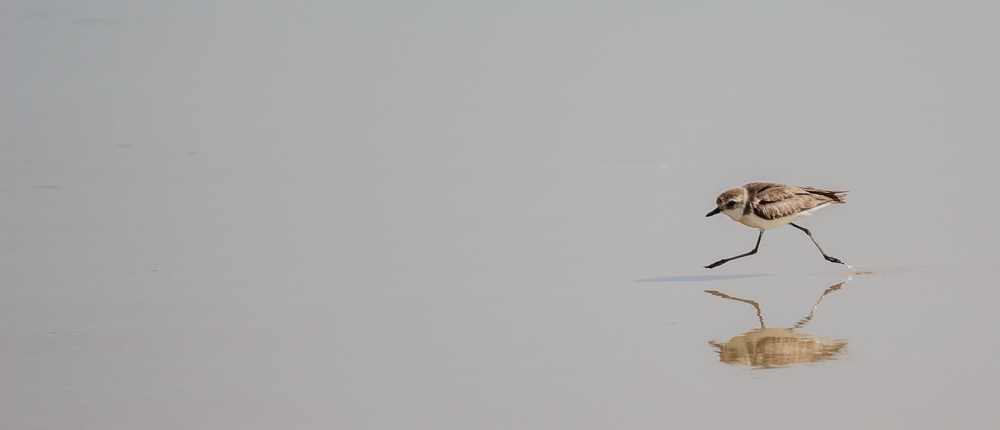

# *Second Run*

- 이 저장소는 세미나 및 자가학습 자료를 정리하기위해 만들어진 두 번째 저장소 입니다.

## *Index*
### DataStructure
 - **[Presentation](https://github.com/MoochiPark/second-run/tree/master/datastructure/presentation)**
 - **[Recursion](https://github.com/MoochiPark/second-run/tree/master/datastructure/recursion)**
 - **[Arraylist](https://github.com/MoochiPark/second-run/tree/master/datastructure/arraylist)**
 - **[LinkedList](https://github.com/MoochiPark/second-run/tree/master/datastructure/linkedlist)**
 - **[Programmers](https://github.com/MoochiPark/second-run/tree/master/datastructure/programmers)**

### Algorithm
 - **[BST](https://github.com/MoochiPark/second-run/tree/master/algorithm/bst)**
 - **[Hash Table](https://github.com/MoochiPark/second-run/tree/master/algorithm/hashtable)**
 - **[Sort](https://github.com/MoochiPark/second-run/tree/master/algorithm/sort)**

### Project
 - **[MicroProcessor](https://github.com/MoochiPark/second-run/tree/master/project/microprocessor)**
 - **[Java co-op](https://github.com/MoochiPark/second-run/tree/master/project/javacoop)**

 

## *Made by*
 - *Daewon Park* *[<daewon@wisoft.io>]*
 -  *Photo by [Vivek Doshi](https://unsplash.com/photos/o8RfmVS0o_4?utm_source=unsplash&utm_medium=referral&utm_content=creditCopyText) on [Unsplash](https://unsplash.com/search/photos/running?utm_source=unsplash&utm_medium=referral&utm_content=creditCopyText)*

